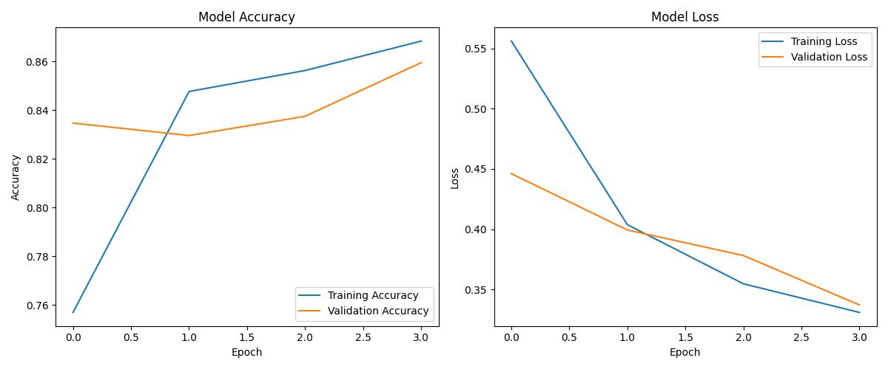

# IMDb Sentiment Analysis with Keras

A deep learning project using Keras to perform binary sentiment classification on the IMDb movie review dataset.

## 🔍 Overview

This project trains a neural network on the IMDb dataset to classify reviews as either positive or negative. The model architecture uses simple dense layers and is trained using binary crossentropy. It visualizes training vs validation accuracy and loss over time.

## 📂 Project Structure

```
imdb-sentiment-analysis/
│
├── saved_models/               # Folder for trained model saved in Keras format
│
│
├── graphs/                     # Training history plot (accuracy and loss)
│
│
├── src/
│   ├── train.py                # Script to train and save the model
│   ├── test.py                 # Script to load the model and run evaluation
│   └── utils.py                # Helper functions like vectorizing sequences
│
├── requirements.txt           # Python dependencies
└── README.md                  # Project documentation
```

## 📦 Installation

1. Clone the repository:

```bash
git clone https://github.com/iaolawuyi/imdb-sentiment-analysis.git
cd imdb-sentiment-analysis
```

2. Install dependencies:

```bash
pip install -r requirements.txt
```

> If `requirements.txt` doesn't exist, you can manually install:
```bash
pip install tensorflow matplotlib numpy
```

## 🚀 How to Run

### Train the Model

From the project root:

```bash
python src/train.py
```

This will:
- Load and preprocess the IMDb dataset
- Train a neural network
- Save the trained model in `saved_models/{model_name}.keras`
- Plot training history to `graphs/{model_name}.jpg`

### Test the Model

Ensure the model file `{model_name}.keras` exists in the `saved_models/` folder.

Run:

```bash
python src/test.py
```

This will:
- Load the trained model
- Evaluate it on the test dataset
- Print accuracy and other relevant metrics

## 📈 Sample Output



## 🧠 Technologies Used

- Python
- TensorFlow / Keras
- IMDb Dataset
- Matplotlib & NumPy

## ✍️ Author

**Ismail A. Olawuyi** – [@iaolawuyi](https://github.com/iaolawuyi)

---

Feel free to use or build upon this for your own NLP/deep learning experiments!
